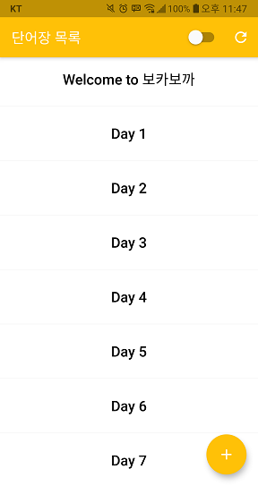
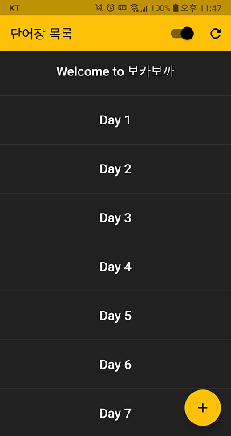
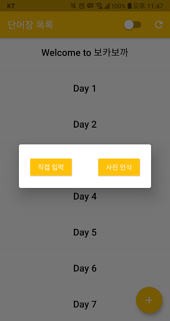
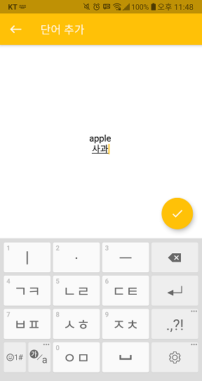
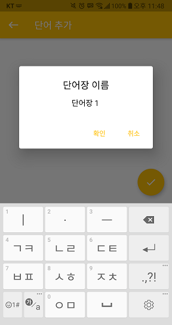
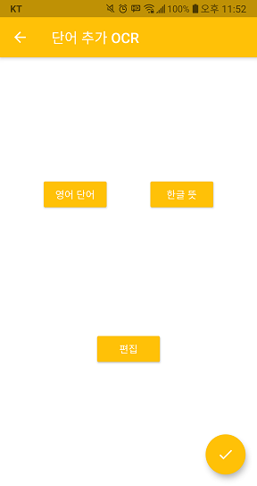
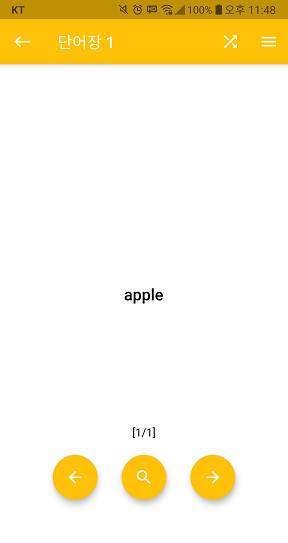
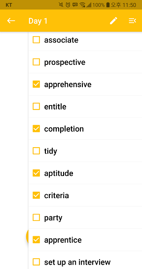
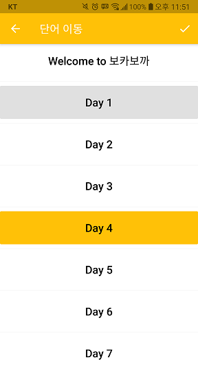

# 보카보까 VOCAVOCA

## 서비스 소개

- 개요
  - 어디서나 편하게 휴대할 수 있는 영단어 암기 앱
- 개발 배경
  - 책으로 된 영어 단어장 사용의 불편을 해소하고자 함
- 개발 인원
  - 1인
- 개발 기간
  - 2021.06.04 ~ 2021.07.02 (4주)

- 주요 기능
  - 외운 단어 숨기기
  - 단어 뜻 가리기
  - 단어 순서 셔플
  - 사진 인식으로 단어 입력
  - 다크 모드 지원
- 배포
  - [구글 플레이](https://play.google.com/store/apps/details?id=com.vocavoca.voca_app)

## 주요 화면

- 메인 화면

  

  - 목록이 비어 있는 상태에서 새로고침 버튼을 누르면 'Welcome to 보카보카' 기본 단어장 생성

- 다크 모드

  

  - 메인 화면의 토글 버튼을 눌러 다크 모드 설정 가능

- 단어장 생성

  

  - \+ 버튼을 누르면 단어장 생성 팝업에서 '직접 입력', '사진 인식' 선택 가능

    - 직접 입력 : 사용자가 직접 타이핑
    - 사진 인식 : 이미지에서 단어 추출

  - 직접 입력

    

    - 홀수 줄은 영단어, 짝수 줄은 단어 뜻 입력

    

    - 체크 버튼을 눌러 단어장 이름 입력 후 단어장 저장

  - 사진 인식

    

    - '영어 단어' 버튼을 눌러 이미지에서 영단어 추출
    - '한글 뜻' 버튼을 눌러 이미지에서 단어 뜻 추출
    - '편집' 버튼을 눌러 오인식된 영단어 및 단어 뜻 수정 가능
    - 체크 버튼을 눌러 단어장 저장

- 암기 화면

  

  - 돋보기 버튼을 눌러 단어 뜻 확인/숨기기 가능
    - 버튼을 꾹 누르면 전체 단어에 해당 기능 적용

  - 상단의 셔플 버튼을 눌러 단어 순서를 무작위로 섞을 수 있음

  

  - 상단의 목록 버튼을 눌러 단어를 수정하거나 외운 단어 체크 가능
    - 체크 표시된 단어는 암기 화면에서 나오지 않음

  

  - 수정 버튼을 눌러 단어 추가, 이동, 삭제 가능
    - 현재 단어가 있는 단어장은 회색으로 표시
    - 이동하려는 단어장은 노란색으로 표시
    - 체크 버튼을 눌러 이동 가능

## 사용 기술

- Flutter 1.22.6

- Tesseract OCR for Flutter 0.3.1

